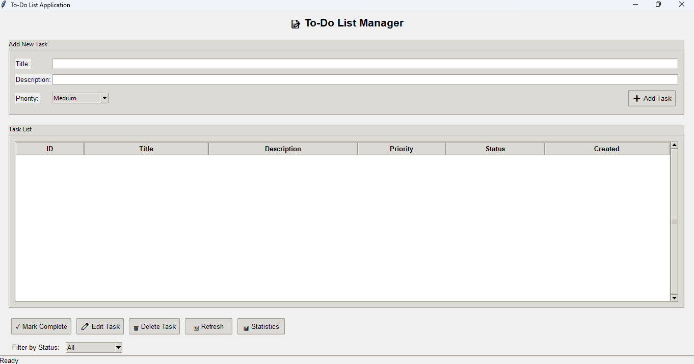

# 📝 To-Do List Application

A Python-based task management application with CLI and GUI interfaces for creating, updating, tracking, and organizing daily tasks efficiently.

## ✨ Features

### Core Functionality
- ➕ **Create Tasks** - Add new tasks with title, description, and priority levels
- 📋 **View Tasks** - Display all tasks or filter by status (Pending/Completed)
- ✏️ **Update Tasks** - Edit existing task details anytime
- ✅ **Mark Complete** - Track task completion with timestamps
- 🗑️ **Delete Tasks** - Remove completed or unnecessary tasks
- 📊 **Statistics Dashboard** - View completion rates and priority breakdown
- 💾 **Auto-Save** - All changes are automatically saved to JSON files

### Priority System
- 🔴 **High Priority** - Urgent tasks requiring immediate attention
- 🟡 **Medium Priority** - Standard tasks (default)
- 🟢 **Low Priority** - Tasks that can be done later

## 🚀 Getting Started

### Prerequisites
- Python 3.6 or higher
- tkinter (pre-installed with Python on Windows)

### Installation
1. Navigate to the project folder
2. No additional dependencies required!

### GUI Version - Main Interface

*The main application window showing the task input form and task list view*
