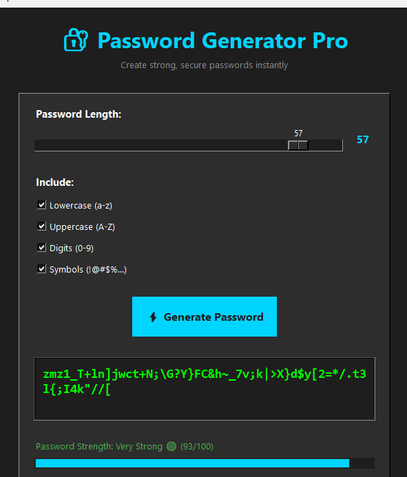

# Password Generator

A simple and secure password generator with both GUI and CLI interfaces.

## Features

- Generate strong passwords with customizable length (4-64 characters)
- Choose character types: lowercase, uppercase, digits, symbols
- Real-time password strength indicator
- Modern dark-themed GUI
- Password history (last 10 passwords)
- One-click copy to clipboard

## Screenshot

Choose your interface:
- **Option 1**: GUI (Graphical Interface)
- **Option 2**: CLI (Command Line)

## Requirements

- Python 3.x
- tkinter (usually included with Python)
